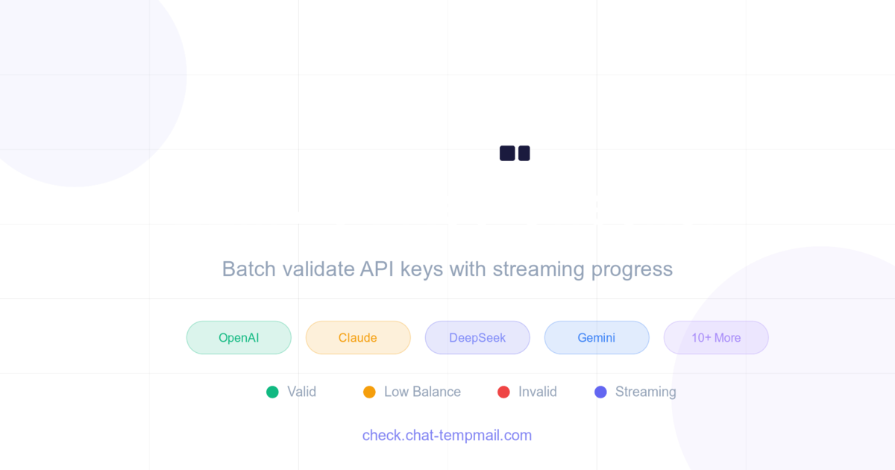

# LLM API Key Checker

<div align="center">



**批量验证多个 LLM 提供商的 API 密钥，实时流式进度显示**

[在线演示](https://check.chat-tempmail.com) | [English Documentation](./README.md)

</div>

---

## ✨ 功能特性

- 🚀 **批量验证** - 同时验证多个 API 密钥，支持可配置的并发数
- 📊 **实时进度** - 流式更新，实时进度跟踪
- 💰 **余额查询** - 支持的提供商自动检测余额
- 🌍 **多语言支持** - 支持 20+ 种语言，包括中文、英文、日文、西班牙文等
- 🎨 **现代化界面** - 精美的毛玻璃设计，支持深色/浅色模式
- 🔒 **隐私优先** - 所有验证在浏览器/服务器运行，密钥从不存储或记录
- ⚡ **多提供商** - 支持 10+ 个 LLM 提供商和 OpenAI 兼容 API

## 🎯 支持的提供商

| 提供商 | 余额查询 | 类型 |
|--------|---------|------|
| OpenAI | ❌ | OpenAI |
| Anthropic (Claude) | ❌ | Anthropic |
| DeepSeek | ✅ | OpenAI |
| Moonshot (月之暗面) | ✅ | OpenAI |
| Zhipu AI (智谱 GLM) | ❌ | OpenAI |
| Tongyi Qwen (通义千问) | ❌ | OpenAI |
| Groq | ❌ | OpenAI |
| Google Gemini | ❌ | OpenAI |
| NewAPI | ✅ | OpenAI |
| OpenAI-compatible (自定义) | 可配置 | OpenAI |

## 🚀 快速开始

### 前置要求

- Node.js 20+ 或 pnpm
- npm、yarn 或 pnpm 包管理器

### 安装步骤

1. 克隆仓库：
```bash
git clone https://github.com/Selenium39/llm-api-key-checker-next.git
cd llm-api-key-checker-next
```

2. 安装依赖：
```bash
npm install
# 或
pnpm install
# 或
yarn install
```

3. 运行开发服务器：
```bash
npm run dev
# 或
pnpm dev
# 或
yarn dev
```

4. 在浏览器中打开 [http://localhost:3000](http://localhost:3000)

## 🔧 使用方法

1. **选择提供商**：从下拉列表中选择支持的 LLM 提供商
2. **配置设置**：
   - Base URL（为兼容端点自定义）
   - 模型名称
   - 并发级别（1-50）
   - 验证提示词
   - 低余额阈值
3. **添加 API 密钥**：粘贴您的密钥（用空格、换行、逗号或分号分隔）
4. **开始验证**：点击"开始"按钮开始批量验证
5. **查看结果**：实时显示结果，包括状态、余额（如果支持）和错误消息

## 📦 技术栈

- **框架**: [Next.js 16](https://nextjs.org/) with App Router
- **语言**: TypeScript
- **样式**: Tailwind CSS 4
- **国际化**: [next-intl](https://next-intl-docs.vercel.app/)
- **虚拟化**: [@tanstack/react-virtual](https://tanstack.com/virtual/latest)
- **React**: React 19

## 🌐 国际化支持

应用支持以下语言：
- 🇺🇸 English（英语）
- 🇨🇳 简体中文
- 🇹🇼 繁體中文
- 🇯🇵 日本語
- 🇰🇷 한국어（韩语）
- 🇪🇸 Español（西班牙语）
- 🇫🇷 Français（法语）
- 🇩🇪 Deutsch（德语）
- 🇮🇹 Italiano（意大利语）
- 🇷🇺 Русский（俄语）
- 🇵🇱 Polski（波兰语）
- 🇳🇱 Nederlands（荷兰语）
- 🇵🇹 Português（葡萄牙语）
- 🇹🇷 Türkçe（土耳其语）
- 🇸🇦 العربية（阿拉伯语）
- 🇮🇳 हिन्दी（印地语）
- 🇮🇩 Bahasa Indonesia（印尼语）
- 🇲🇾 Bahasa Melayu（马来语）
- 🇹🇭 ไทย（泰语）
- 🇻🇳 Tiếng Việt（越南语）

## 🔐 隐私与安全

- ✅ API 密钥不会存储在数据库中
- ✅ 不记录敏感信息
- ✅ 验证在客户端和服务器端进行（流式传输）
- ✅ 开源且可审计

## 📝 API 路由

### POST `/api/check`
使用流式响应验证 API 密钥。

**请求体：**
```json
{
  "provider": "openai",
  "baseUrl": "https://api.openai.com/v1",
  "model": "gpt-4o-mini",
  "keys": ["sk-..."],
  "concurrency": 10,
  "validationPrompt": "Hi",
  "lowThreshold": 1
}
```

**响应格式（流式 JSON）：**
```json
{"type":"meta","total":5}
{"type":"result","done":1,"result":{"key":"sk-...","status":"valid","balance":10.5,"message":"OK"}}
{"type":"result","done":2,"result":{"key":"sk-...","status":"invalid","message":"Invalid API key"}}
{"type":"done","done":5}
```

### POST `/api/models`
获取给定提供商和 API 密钥的可用模型列表。

**请求体：**
```json
{
  "provider": "openai",
  "baseUrl": "https://api.openai.com/v1",
  "keys": ["sk-..."]
}
```

**响应：**
```json
{
  "models": ["gpt-4o", "gpt-4o-mini", "gpt-3.5-turbo"]
}
```

## 🎨 项目结构

```
llm-api-key-checker-next/
├── src/
│   ├── app/
│   │   ├── [locale]/          # 国际化路由
│   │   │   ├── layout.tsx     # 布局组件
│   │   │   └── page.tsx       # 主页面
│   │   ├── api/
│   │   │   ├── check/         # 验证 API
│   │   │   └── models/        # 模型列表 API
│   │   └── globals.css        # 全局样式
│   ├── i18n/
│   │   └── request.ts         # i18n 配置
│   ├── lib/
│   │   ├── checkers.ts        # 验证逻辑
│   │   ├── locales.ts         # 语言配置
│   │   └── providers.ts       # 提供商配置
│   └── middleware.ts          # Next.js 中间件
├── messages/                  # 翻译文件
│   ├── en.json
│   ├── zh-cn.json
│   └── ...
├── public/                    # 静态资源
├── README.md                  # 英文文档
├── README_CN.md              # 中文文档
└── LICENSE                    # MIT 许可证
```

## 🤝 贡献指南

欢迎贡献！请随时提交 Pull Request。

1. Fork 本仓库
2. 创建您的特性分支 (`git checkout -b feature/AmazingFeature`)
3. 提交您的更改 (`git commit -m 'Add some AmazingFeature'`)
4. 推送到分支 (`git push origin feature/AmazingFeature`)
5. 打开一个 Pull Request

### 贡献建议

- 🐛 修复 Bug
- ✨ 添加新功能
- 📝 改进文档
- 🌍 添加新的语言翻译
- 🎨 改进 UI/UX
- ⚡ 性能优化

## 🔨 构建和部署

### 构建生产版本

```bash
npm run build
# 或
pnpm build
```

### 运行生产服务器

```bash
npm run start
# 或
pnpm start
```

### 部署到 Vercel

点击下方按钮一键部署到 Vercel：

[](https://vercel.com/new/clone?repository-url=https://github.com/Selenium39/llm-api-key-checker-next)

## 📄 许可证

本项目采用 [MIT 许可证](LICENSE) 开源。

## 💖 赞助商

本项目由 [ChatTempMail](https://chat-tempmail.com) 赞助 - 一个免费的临时邮箱服务，集成 AI 功能。

## 🙏 致谢

- 感谢所有贡献者
- 使用现代 Web 技术构建
- 灵感来自于高效 API 密钥管理的需求

## ❓ 常见问题

### 1. 什么是 LLM API Key Checker？
这是一个免费的在线工具，用于批量验证各种 LLM 提供商的 API 密钥，包括 OpenAI、Anthropic Claude、DeepSeek 等。

### 2. 支持哪些 LLM 提供商？
我们支持 OpenAI、Anthropic (Claude)、DeepSeek、Moonshot、智谱 AI、通义千问、Groq、Google Gemini，以及任何 OpenAI 兼容的 API。

### 3. 我的 API 密钥安全吗？
是的。所有验证都在您的浏览器和我们的服务器中进行。我们从不存储或记录您的 API 密钥。

### 4. 可以同时验证多少个密钥？
没有限制！您可以一次性粘贴任意数量的密钥，系统会自动去重并批量验证。

### 5. 并发数设置多少合适？
建议设置为 5-20 之间。过高的并发可能会触发某些提供商的速率限制。

### 6. 为什么有些提供商不支持余额查询？
某些提供商的 API 不提供余额查询接口，或需要特殊的权限。我们会持续更新支持。

## 📧 联系方式

- GitHub: [@Selenium39](https://github.com/Selenium39)
- 项目地址: [https://github.com/Selenium39/llm-api-key-checker-next](https://github.com/Selenium39/llm-api-key-checker-next)
- 在线演示: [https://check.chat-tempmail.com](https://check.chat-tempmail.com)

## 🌟 Star History

如果这个项目对您有帮助，请给我们一个 ⭐️！

[](https://star-history.com/#Selenium39/llm-api-key-checker-next&Date)

---

<div align="center">

用 ❤️ 由开源社区打造

**[⬆ 返回顶部](#llm-api-key-checker)**

</div>
